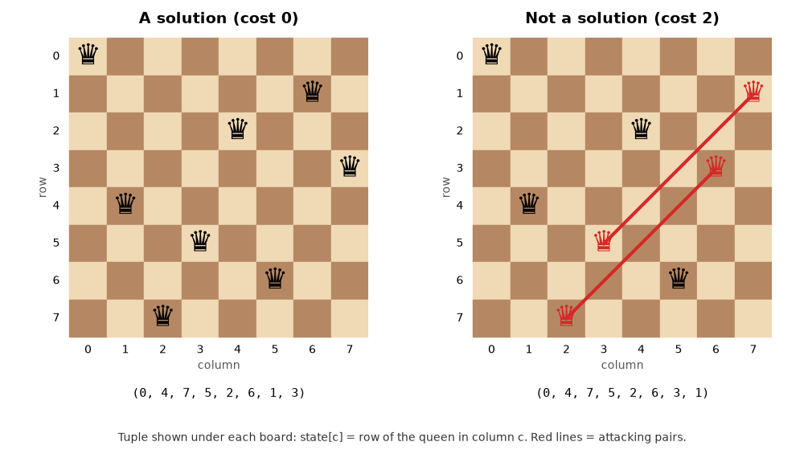
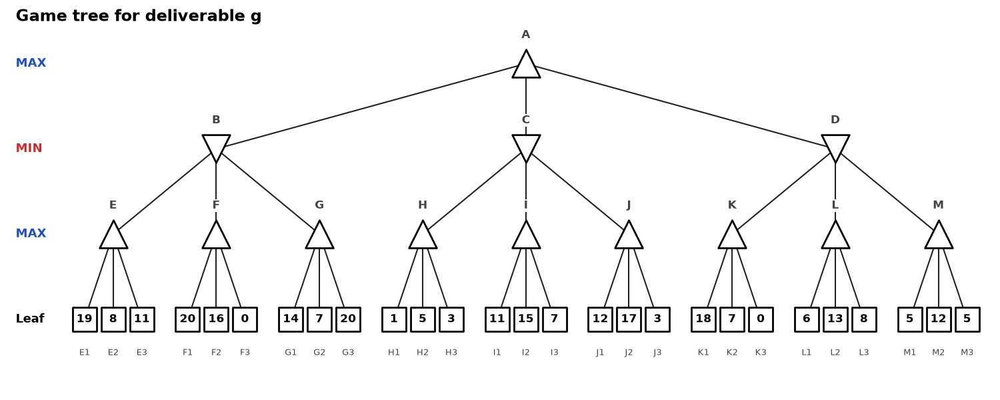

# Assignments: Search Algorithms

Two assignments. No starter code: write everything yourself in your own notebook.

**Rules (both assignments)**

- Python standard library only (`random`, `math`, `time`, `heapq`, `collections`, ...). No NumPy, no solver libraries.
- Submit with all outputs visible, after *Kernel → Restart & Run All* runs without errors.
- Every number you report must be produced by your code, not typed by hand.
- Discuss ideas with classmates if you like, but write your own code.

<b>Assignment 1: N-Queens</b>

Place **n queens** on an **n × n** board so that no two queens share a row, a column or a diagonal.



**Representation: your choice.** For example:

| Representation | Example (n = 4) | Note |
|---|---|---|
| tuple, `state[c]` = row of the queen in column c | `(1, 3, 0, 2)` | one queen per column, so columns never clash |
| grid (list of lists, 1 = queen) | `[[0,0,1,0], [1,0,0,0], [0,0,0,1], [0,1,0,0]]` | closest to the picture; you must check rows, columns and diagonals |
| set of (row, col) positions | `{(1,0), (3,1), (0,2), (2,3)}` | easy to test membership |

Say in one or two sentences why you chose yours: it decides which conflicts you must check and what a
neighbour state is.

**Algorithms: pick two.**

- **A. DFS with backtracking** (required): place queens one at a time and backtrack as soon as the new
  queen conflicts with an earlier one.
- One local search: **B. Hill Climbing** (simple or steepest-ascent), **C. Simulated Annealing** or
  **D. Genetic Algorithm**. Use cost = number of attacking pairs; cost 0 means solved.

BFS, IDS, UCS, Greedy Best-First and A\* are **not allowed** (question f asks why). Deliverable g is a
separate game-tree problem and also needs minimax and alpha-beta pruning.

### Deliverables

One markdown heading per item, **a** to **h**, in this order.

- **a. Implementation.** Both algorithms, each with a counter: nodes expanded for DFS, iterations for
  the local search.
- **b. Results table**, printed by your code:

  | algorithm | n=8 solved? | n=20 solved? | nodes/iterations (n=8 / n=20) | runtime (n=8 / n=20, with unit) |
  |---|---|---|---|---|

- **c. Success rate.** Run your local search 100 times from random n = 8 starts and report the success
  rate. Plain steepest-ascent hill climbing solves about **14%** (Russell & Norvig, *AIMA*). Explain
  your difference using your own choices: tie-breaking, sideways moves, restarts, iteration limit,
  cooling schedule, population size, mutation rate.
- **d. Failure case.** Find one state where your local search stops without solving the puzzle. Paste
  that state and show with code that none of its neighbours has a lower cost.
- **e. Backtracking analysis.** Report nodes expanded by DFS for n = 8 and n = 20. Why does pruning on
  conflict matter so much as n grows? Compare with the number of complete placements in your
  representation (n<sup>n</sup> for one queen per column).
- **f. Written question.** For **each** of BFS, IDS, UCS, Greedy Best-First and A\*: what does it
  optimise, and why is that useless or harmful here? Hint: at what depth is every solution, and do
  solutions differ in path cost?

<b>Assignment 2: Alpha-beta pruning</b>

MAX moves at A in the game tree below; each leaf is the utility for MAX.
Store the tree however you like.



```python
tree = {
    'A': ['B', 'C', 'D'],
    'B': ['E', 'F', 'G'], 'C': ['H', 'I', 'J'], 'D': ['K', 'L', 'M'],
}
leaf_values = {   # leaves of E are E1, E2, E3, left to right, and so on
    'E': [19, 8, 11], 'F': [20, 16, 0], 'G': [14, 7, 20],
    'H': [1, 5, 3],   'I': [11, 15, 7], 'J': [12, 17, 3],
    'K': [18, 7, 0],  'L': [6, 13, 8],  'M': [5, 12, 5],
}
```

1. Implement **minimax** and **alpha-beta pruning**, each counting the nodes it visits. Make
   alpha-beta print every cut: the node where α ≥ β and the children it skips.
2. Print a table with best move, value and nodes visited for: minimax, alpha-beta on the tree as
   given, and alpha-beta with every child list reversed.
3. Reorder the children (the leaves stay attached to their parents) so that alpha-beta visits as
   **few** nodes as possible, then as **many** as possible. Report both counts and the orderings you
   used.
4. Explain: why are the best move and the value the same in every run, why do the node counts differ,
   and what rule did you use to build the best ordering?

**h. Oral defence.** Be ready to explain any line of your code in the demo.

### Submission

- One notebook: `Assignment1_<StudentID>_<FullName>.ipynb`.
- Written answers (c, e, f, g) in English, in markdown cells under the output they discuss.
- Deadline and submission channel: announced by the teaching assistant.
